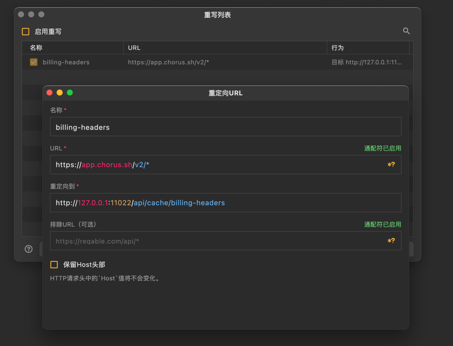

# Chorus2api-Helper 

## 部署步骤

### Mac 环境运行
```bash
./chorus2api-helper
```

### 部署效果



### 内网穿透 [可选]
如需外网访问，可配置内网穿透服务。

## [Chorus2api](https://2api-docs.pages.dev/page/chorus2api/quick-deploy.html) 配置

### 添加环境变量
```
CHEAT_URL=http://192.168.124.20:11022
```
> 注意：如使用内网穿透，需填写对应的域名地址

### 配置效果


## 相关链接
- [GitHub 发布页](https://github.com/deanxv/chorus2api-helper-releases/releases)