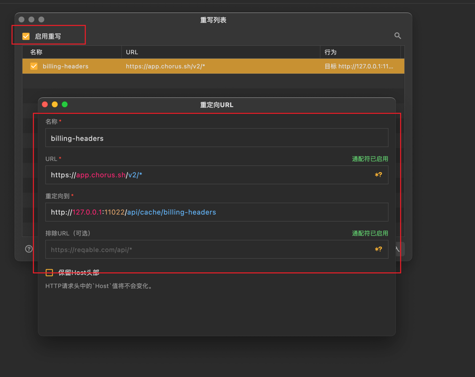

# Chorus2api-Helper 

> 部署前的准备
> 1. **Mac环境**(最好是闲置机,因为会有脚本执行)
> 2. 下载[Chorus](https://chorus.sh/)
> 3. 下载[reqable](https://reqable.com/zh-CN/download/)

## Reqable配置

1. 打开`Reqable`,登陆后点击左上角**工具**->**重写**。

    

2. 在**重写**窗口的**右下角导入**下面的`json`配置(提前将该配置内容保存文件并命名为xxx.config),新建好配置后点击左上角**启用重写**。

   

```json
[
  {
    "id": "a5b49af6-c280-479e-a15d-df1a9ee2b693",
    "name": "billing-headers",
    "url": "https://app.chorus.sh/v2/*",
    "wildcard": true,
    "action": {
      "type": 0,
      "redirectUrl": "http://127.0.0.1:11022/api/cache/billing-headers",
      "preserveHost": false,
      "excludeUrl": "",
      "excludeWildcard": true
    },
    "isEnabled": true
  }
]
```

**也可以不导入直接选择新建,只要配置后是图中所示即可。**

名称: `billing-headers`

URL: `https://app.chorus.sh/v2/*`

重定向到: `http://127.0.0.1:11022/api/cache/billing-headers`

  

3. 此时即可回到Reqable首页,右上角的**重写**、**代理**、**SSL**都确认**开启**状态后点击**启用**。


## Chorus2api-Helper启动

下载地址: [chorus2api-helper-releases](https://github.com/deanxv/chorus2api-helper-releases/releases)

1. 打开终端，进入到`Chorus2api-Helper`执行文件目录下。
2. 执行命令`./chorus2api-helper`,等待第一次执行结束后如图中所示即为成功。
3. 图中红框所示即为[chorus2api](https://2api-docs.pages.dev/page/chorus2api/quick-deploy.html)项目中的环境变量`CHEAT_URL`，如内网穿透则需要填写域名。

   

Enjoy It! ✨
